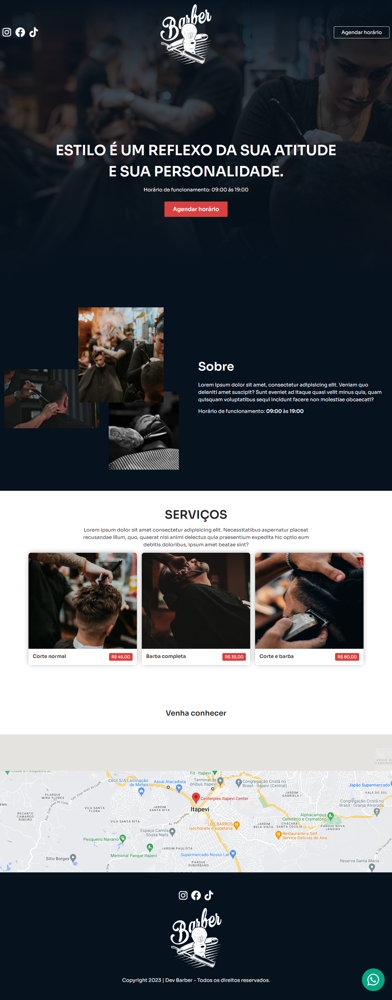

# Dev Barber - Landing Page

<!-- fonte para readme stats: https://github.com/anuraghazra/github-readme-stats -->
<!-- fonte para badges e shieds: https://github.com/iuricode/readme-template/tree/main -->

## 📄 Sobre
Landing page que simula a apresentação de uma barbearia replicado da [série especial](https://sujeitoprogramador.com/landing-page/) feita pelo canal do YouTube [Sujeito Programador](https://sujeitoprogramador.com/), com o objetivo de estudar e práticar os conhecimentos de HTML e CSS (com SASS)

📸 Screenshot

  

🌐 [Versão em produção](https://devbarber-landingpage.vercel.app/)

## 🛠 Funcionalidades

Landing page de apresentação de uma barbearia, com as informações de horário de funcionamento, localização, links de redes sociais e apresentação dos serviços com valores.

## 🎓 Aprendizados

Aprendi nesse projeto:
- Como organizar arquivos CSS com o SASS;
- Como utilizar apenas a propriedade `display: flex` para trabalhar com responsividade
- Como utilizar animações simples com a propriedade `@keyframes`.
- Como fazer o upload de um projeto do GitHub para o [Vercel](https://vercel.com/)

## 🧰 Tecnologias e Recursos Utilizados

- [Figma](https://www.figma.com/file/6kiSdVqT1Dxs3uPgW2Psur/Landing-Page-Barber?type=design&node-id=0%3A1&mode=design&t=XxnkFp0h2WfED6Iu-1) para apresentação do mockup do projeto
- [Google Fonts](https://fonts.google.com/specimen/Sora) Sora
- [Font Awesome](https://fontawesome.com/) para ícones
- [Animate On Scroll Library](https://michalsnik.github.io/aos/)

## 🔜 Pro Futuro
Por enquanto nada...

## 🤝 Quem fez?

Oi, meu nome é Sérgio Leitão, você pode me achar em qualquer uma das redes abaixo pra bater um papo:

  
  
  

 

Aqui é o meu perfil profissonal, podemos bater um papo mais sério:

  

 

Ou você pode me mandar uma mensagem por aqui...

  

 

Ahhh, se puder, dá uma passada no meu site...lá além de outros projetos tão legais quanto esse (a internet é uma mina de ouro...só procurar bem!), estou sempre atualizando com o que acho de mais legal e interessante sobre tecnologia e outras <i>cositas mas</i>...acessa ai:  
🖥 <a href="https://sergioleitao.com.br">sergioleitao.com.br</a>

## 🎯 Status

- Projeto finalizado conforme o tutorial.
- Veja ele vivinho da Silva [aqui](https://devbarber-landingpage.vercel.app/)

## © Licença

- [MIT](https://choosealicense.com/licenses/mit/)
